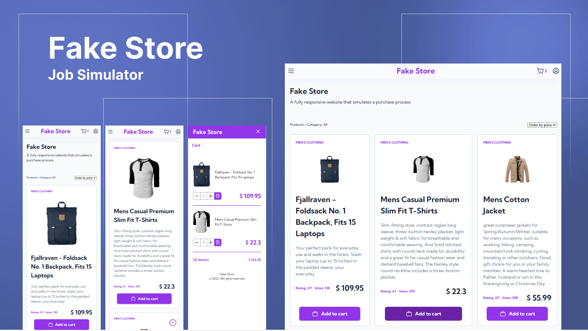

<h1 align="center"> Fake Store </h1>

Personal project to practice knoldgements in HTML, CSS and JavaScript.

  <a href="#Techs">Tech</a>&nbsp;&nbsp;&nbsp;|&nbsp;&nbsp;&nbsp;
  <a href="#Project">Projeto</a>&nbsp;&nbsp;&nbsp;|&nbsp;&nbsp;&nbsp;
  <a href="#Layout">Layout</a>&nbsp;&nbsp;&nbsp;|&nbsp;&nbsp;&nbsp;
  <a href="#Learn">What I've learned</a>

 

<!-- 

  

 -->

## Techs

This project was developed with following technologies:

- [HTML](https://developer.mozilla.org/pt-BR/docs/Web/HTML)
- [CSS](https://developer.mozilla.org/en-US/docs/Web/CSS)
- [JavaScript](https://developer.mozilla.org/pt-BR/docs/Web/JavaScript)

## Project

This project simulates a purchase process in a web store, the Fake Store.
I used 

### Requirements and functionalities

- 

## Layout

I used Figma to design build.

## Learn

---

Made by [Anderson Vieira](https://linkedin/in/vieira-a)